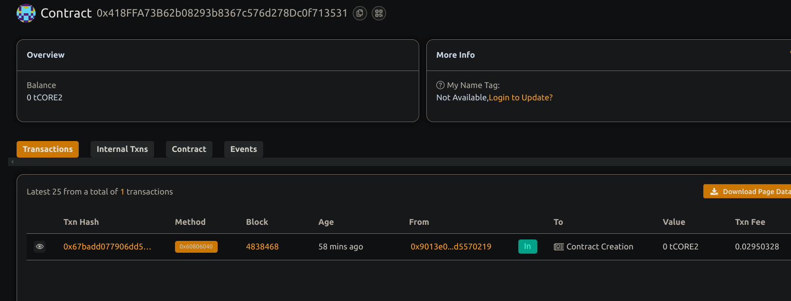

# Decentralized storage incentive system

## Project Description

A blockchain-based platform that incentivizes users to provide decentralized storage resources by rewarding them with cryptocurrency based on the amount of storage offered and time duration.

## Project Vision

To foster a robust and distributed storage network by financially motivating providers, increasing data availability and decentralization while empowering participants through transparent smart contracts.
 
  ## Key Features

- Providers register their available storage in GB
- Rewards calculated based on storage size and duration
- Claimable rewards paid out in Ether
- Owner can update reward rates dynamically
- Transparent tracking of storage and earnings
  

## Future Scope

1- Integration with decentralized file storage networks like IPFS or Filecoin
- Support for ERC20 token-based rewards
- Automated verification of storage proofs
- Tiered incentive models based on reliability and uptime
- User-friendly dashboard for providers to monitor stats

      ## Contract details
0x418FFA73B62b08293b8367c576d278Dc0f713531

